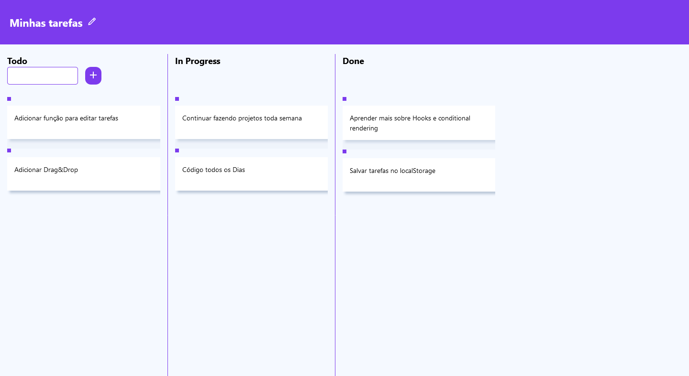

# KanBan Project

## The Project

- Users can add new tasks todo
- Delete tasks
- Move tasks forward acording to status (todo, inProgress, done)
- Responsive for any screen size
- Edit Tasks **[in progress]**

## Built With

- Reactjs
- CSS custom properties
- Flexbox

## Screenshot

## Authors

- [Github](https://github.com/heiderick13)
- [LinkedIn](https://www.linkedin.com/in/marcelo-ferreira-de-oliveira/)
